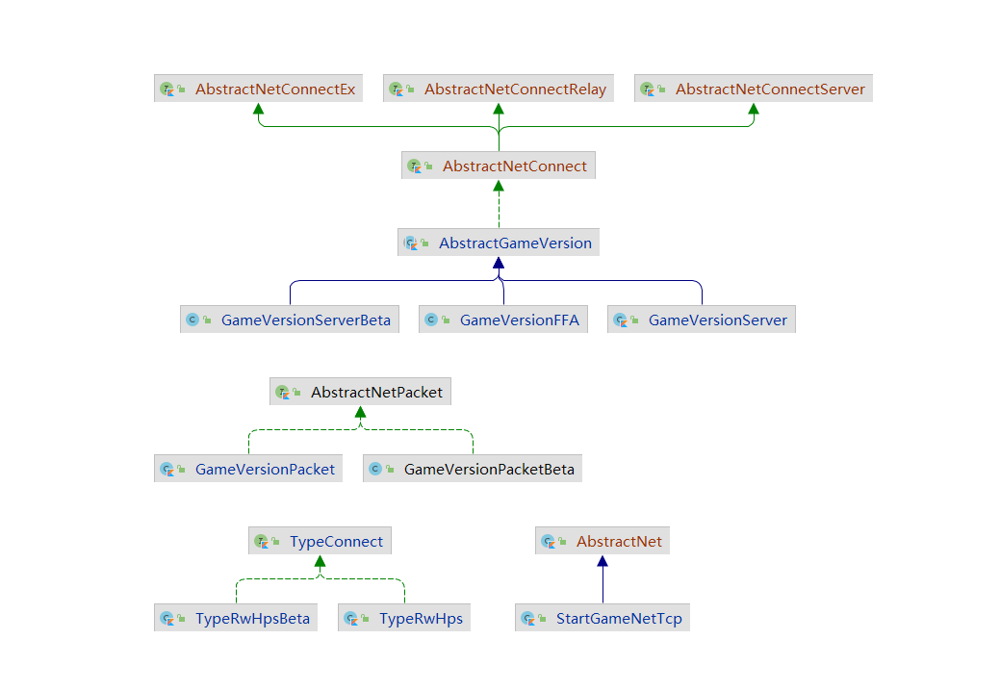

# RW-HPS - Concise API

> 注:
> - 本章节展示关于 `RW-HPS-core-api` 比较常用的 API 示例
> - 请配合 `RW-HPS-core-api` 源码查看
> - 本章仅提供 API 粗略介绍

----------------------

# GameServer

## StartNet

`StartNet` 用于创建一个新的 `StartNet`

```java
StartNet bot = new StartNet();
```

# Misc utils

## Log

RW-HPS 全部的日志都通过 `Log` 输出, 查看 `Log` 源码注释获得更多信息

## FileUtil

`FileUtil` 代表一个外部文件  

构造 `FileUtil` 可以通过以下方法构造

```java
// 因为不会创建文件 同时 位置和Jar同目录
FileUtil.getFile("文件名");
// 因为不会创建文件 只会创建目录
FileUtil.getFolder("文件夹名"); 
// 只会创建目录
FileUtil.getFolder("文件夹名").toFile("文件名");
/**
FileUtil的三个实例什么都不会做 也不会创建目录和文件
如果需要先目录再文件 那么用FileUtil.toFolder(文件夹名).toFile(文件名)
如果需要先进入多个目录 那么用FileUtil.toFolder(文件夹名).toFolder(文件夹名)
只有使用FileUtil().read/Write时才会进行文件创建
注意:
FileUtil.toFolder初始目录是Server.jar的目录或者Main提交的参数目录
toFolder只是起一个进入作用
*/
// 获取临时文件
FileUtil.getTempFile("文件名")
// 获取临时文件夹
FileUtil.getTempDirectory("文件夹名")
// 会创建文件夹并尝试创建文件
FileUtil().mkdir();
// 会尝试创建文件
FileUtil().createNewFile();
```

# Events
[Events](Events.md)

# Net框架
